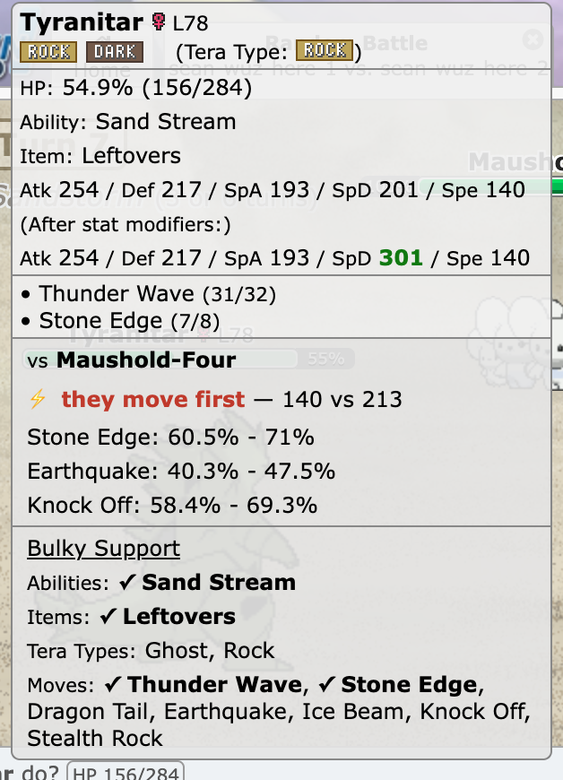
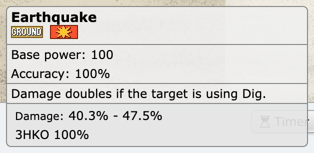

# hi-chu

*(hi-chew × pikachu)*

<p align="center">
  
  
</p>

Battle helpers, one hover away. hi-chu is a small browser extension that enriches
[Pokémon Showdown][showdown]'s in-battle tooltips:

- How much damage will each move do?
- What Random Battles set is the opponent Pokémon running?
- Who's faster?

Grabs set data from [`pkmn.github.io/randbats`][feed] and calculates damage with
[`@smogon/calc`][calc].

## How it's built

The design is a small pure core behind a thin shell, and the shell itself splits in two:
`content.ts` is the only *impure* piece — it monkey-patches Showdown's tooltip and touches
the DOM/network directly — but it hands the actual work to `section.ts`, which is pure
(no DOM, no cache, no network of its own) and does the real folding. Below that, three
steps stay strictly separate — **fetch** (the live page, the network), **reason** (the
domain logic), **render** (model → HTML) — so a step never reaches into the DOM or the
network unless that IS its job. Dependencies only ever point downward:

```
┌───────────────────────────────────────────────────┐
│ content.ts                      the shell (impure)│
│ monkey-patches Showdown's tooltip,                │
│ triggers the fetch, hands the hover to section.ts │
└───────────────────────────────────────────────────┘
                          │ hover event
                          ▼
┌───────────────────────────────────────────────────┐
│ section.ts                       pure orchestrator│
│ given the battle, the hover,                      │
│ and the data → folds FETCH → REASON               │
│ → RENDER into one HTML string                     │
└───────────────────────────────────────────────────┘
                          │
                          ▼
┌───────────────────────────────────────────────────┐
│ FETCH                 reads the page + the network│
│ ┌──────────────────────┐  ┌──────────────────────┐│
│ │ battle/readState.ts  │  │ data/randbats.ts     ││
│ │ PS client objects    │  │ fetch + cache        ││
│ │ → typed LiveFacts    │  │ the sets feed        ││
│ └──────────────────────┘  └──────────────────────┘│
└───────────────────────────────────────────────────┘
                          │
                          ▼
┌───────────────────────────────────────────────────┐
│ REASON                     pure: given x, return y│
│ ┌──────────────────────┐  ┌──────────────────────┐│
│ │ resolve.ts           │  │ damage.ts            ││
│ │ given LiveFacts + a  │  │ given 2 ResolvedMon  ││
│ │ set → one ResolvedMon│  │ + move → DamageReport││
│ └──────────────────────┘  └──────────────────────┘│
│ ┌──────────────────────┐  ┌──────────────────────┐│
│ │ assume.ts            │  │ variants.ts          ││
│ │ given LiveFacts, no  │  │ given scored variants││
│ │ feed → 2 bracket sets│  │ → distinct buckets   ││
│ └──────────────────────┘  └──────────────────────┘│
│ ┌──────────────────────┐  ┌──────────────────────┐│
│ │ speed.ts             │  │ multihit.ts          ││
│ │ given a ResolvedMon  │  │ given per-hit + hit- ││
│ │ → effective Speed    │  │ count PMF → total PMF││
│ └──────────────────────┘  └──────────────────────┘│
│ ┌──────────────────────┐  ┌──────────────────────┐│
│ │ moves.ts             │  │ types.ts             ││
│ │ data: multi-hit table│  │ types: shared vocab  ││
│ │ (from PS data)       │  │ used by every stage  ││
│ └──────────────────────┘  └──────────────────────┘│
└───────────────────────────────────────────────────┘
                          │
                          ▼
┌───────────────────────────────────────────────────┐
│ RENDER                     pure: given x, return y│
│ ┌──────────────────────┐                          │
│ │ render.ts            │                          │
│ │ given a render model │                          │
│ │ → tooltip HTML string│                          │
│ └──────────────────────┘                          │
└───────────────────────────────────────────────────┘
                          │ tooltip HTML
                          ▼
```

At runtime those modules fold together top to bottom. The only thing the format changes
is *where the foe's possibilities come from* — everything below that seam is shared:

```
┌──────────────────────────────────────────────────────────────────────────┐
│ battle/readState.ts                                                      │
│ client Pokemon objects → LiveFacts:                                      │
│ only what the battle has made public                                     │
└──────────────────────────────────────────────────────────────────────────┘
                                      │ what we KNOW
                                      ▼
──────────────── what the foe COULD be — exactly one source ────────────────
┌──────────────────────────────────┐    ┌──────────────────────────────────┐
│ core/resolve.ts             feed │    │ core/assume.ts           no feed │
│ every set the species can run,   │    │ the two spreads that BRACKET it: │
│ narrowed by public reveals       │    │ uninvested / max HP+Def          │
└──────────────────────────────────┘    └──────────────────────────────────┘
                  └───────────────────┬───────────────────┘
                                      │ what we ASSUME
                                      ▼
┌──────────────────────────────────────────────────────────────────────────┐
│ buildResolved                                                ResolvedMon │
│ known facts win; the source fills the gaps                               │
│ → the concrete set(s) we calculate with                                  │
└──────────────────────────────────────────────────────────────────────────┘
                                      │
                                      ▼
┌──────────────────────────────────────────────────────────────────────────┐
│ core/damage.ts                                              DamageReport │
│ wrap @smogon/calc; own the multi-hit law                                 │
│ → one DamageReport per possible set                                      │
└──────────────────────────────────────────────────────────────────────────┘
                                      │
                                      ▼
┌──────────────────────────────────────────────────────────────────────────┐
│ core/variants.ts                                            DamageBucket │
│ collapse identical numbers, name what differs                            │
│ → one line per DISTINCT outcome                                          │
└──────────────────────────────────────────────────────────────────────────┘
                                      │
                                      ▼
┌──────────────────────────────────────────────────────────────────────────┐
│ core/render.ts                                                      HTML │
│ model → tooltip HTML string                                              │
└──────────────────────────────────────────────────────────────────────────┘
                                      │ tooltip
                                      ▼
```

### The pure core (`src/core`)

- **`multihit.ts`** — the multi-hit fix: `@smogon/calc` treats a *k*-hit move as
  `k × one shared roll` (wrong on both counts), so this convolves independent per-hit
  rolls over the real hit-count distribution — Skill Link, Loaded Dice, and the
  multiaccuracy stop-at-miss law included, sourced from Showdown's own
  `sim/battle-actions.ts`/`data/items.ts`. Every per-hit accuracy modifier is modeled
  too — Compound Eyes, Hustle, No Guard, accuracy/evasion stat stages — verified against
  the real simulator, not just its source (see `CLAUDE.md`).
- **`moves.ts`** — the multi-hit move table, derived from Showdown's `data/moves.ts`:
  each move's hit spec, its per-hit accuracy if it checks one, and — for Triple Axel
  (20/40/60) and Triple Kick (10/20/30), the only two — each hit's own base power.
- **`resolve.ts`** — merges known live facts over assumed randbats possibilities into
  the one concrete set we calculate with. Revealed facts always win; a Tera type is
  only ever applied when the Pokémon has actually terastallized. (Two previews, both for
  *your own* active Pokémon and its pending move: ticking the move panel's Terastallize
  checkbox calculates as if your Tera — your private, known type — were already active;
  ticking Mega Evolution overlays your active mon's Mega forme, read from the stone it's
  holding via the client dex. The Mega's stats feed the damage; its Speed feeds the ⚡
  speed verdict from Gen 7 on — Gen 6 moved at base Speed the turn it evolved.)
- **`assume.ts`** — the same job where no set feed exists. It brackets the foe's unknown
  defensive investment with its two extremes (uninvested, and maxed on whichever defence
  the move attacks) crossed with the species' possible abilities, and reuses `resolve.ts`'s
  "revealed facts always win" writer so that law is written once. It deliberately skips the
  set-narrowing step: there are no candidate sets to narrow.
- **`damage.ts`** — wraps `@smogon/calc`, running it once per hit for multi-hit moves
  and feeding `multihit.ts`'s convolution. It also turns your Pokémon's server-reported
  final stats into an equivalent EV/nature spread, the only form that survives the
  calc's internal copy of each Pokémon.
- **`speed.ts`** — the speed-order law. Effective Speed per still-possible set — the
  arithmetic (Scarf, paralysis, Tailwind, boosts, weather abilities) delegated to
  `@smogon/calc`'s `getFinalSpeed` — with identical numbers collapsed into distinct
  outcomes the same way damage is, and Trick Room flipping the who-moves-first verdict
  (an order inversion, never a stat change).
- **`render.ts`** — turns reports into the tooltip HTML string (kept pure so it can be
  snapshot-tested rather than eyeballed in a browser).

### The shell

- **`src/data/randbats.ts`** — fetches and caches the set feed (memory + `localStorage`
  with a TTL).
- **`src/battle/readState.ts`** — reads Showdown's untyped client objects into our
  typed `LiveFacts` and `FieldFacts` (weather, terrain, the defender's screens). The
  structural `ClientPokemon`/`ClientBattle`/`ClientSide` interfaces document exactly
  which client fields we depend on.
- **`src/content.ts`** — a *content script* (JS the extension injects into the page);
  `world: "MAIN"` runs it in the page's own JS context (Chrome Manifest V3, "MV3") so it
  can reach Showdown's objects. It *monkey-patches* (wraps at runtime)
  `BattleTooltips.prototype.showPokemonTooltip` and appends our section. Everything is
  wrapped so our code can never break Showdown's own tooltip. It stays trivial on purpose —
  it triggers the feed fetch, reads the Tera/Mega toggles, and hands everything else to
  `section.ts`.
- **`src/section.ts`** — the actual orchestration, and the reason `content.ts` can stay
  trivial: given the live battle, the hovered thing, and the feed data, it folds
  fetch → reason → render into the tooltip's HTML string. It's pure itself (no DOM, no
  cache, no network — `content.ts` owns that plumbing and hands the cached data in), which
  is what lets `section.test.ts` drive the exact code path a live hover runs, against a
  real captured battle, without a browser.

For exact shapes and signatures, read the source and the `*.test.ts` files next to each
module — the tests are the worked examples (and pin the numbers against Showdown).

## Develop

```sh
npm install
npm test          # the math, the merge, the render, field effects, the dependency boundary, and an end-to-end run on real data
npm run typecheck
npm run build     # bundles to dist/ (content.js + manifest.json)
npm run watch     # rebuild on save
```

`npm install` also points git at `.githooks/` (the `prepare` script), which refuses a commit
or push made directly against `main` — every change goes through a branch + PR instead,
matching `main`'s GitHub branch protection.

## Install

**From a release (no build needed):**

1. Download `hi-chu-<version>.zip` from the [latest release][releases] and unzip it.
2. Visit `chrome://extensions`, enable **Developer mode** (top-right).
3. **Load unpacked** → select the unzipped folder.
4. Open a battle on `play.pokemonshowdown.com` and hover a Pokémon or one of your
   move buttons — the extra lines appear at the bottom of the tooltip. (A Random Battle
   gets everything; any other format gets the damage lines.)

*(Firefox: `about:debugging` → **This Firefox** → **Load Temporary Add-on** → pick the
`manifest.json` inside the unzipped folder.)*

**From source:** `npm install && npm run build`, then Load unpacked → `dist/`. Run
`npm run package` to produce the release zip yourself.

## Verifying a release

Every tagged release ships with a Sigstore-signed [build-provenance attestation][slsa]
and a `SHA256SUMS` file:

```sh
gh attestation verify hi-chu-0.2.0.zip --repo seanaujong/hi-chu
```

A ✓ means GitHub verified the signature: this exact zip was produced by the Release
workflow, from a commit you can inspect. No keys to trust by hand.

**Prove the shipped code matches the source.** The bundled `content.js` is produced
deterministically by esbuild at the version pinned in `package-lock.json`, so you can
rebuild it and compare hashes:

```sh
git checkout v0.2.0
npm ci && npm run build
sha256sum dist/content.js          # compare to content.js in the release's SHA256SUMS
```

Identical hashes mean the code Chrome runs is exactly the open source in this repo.
(The Chrome Web Store repackages and re-signs uploads, so the *installed* extension is
additionally signed by Google — but these two checks are what tie it back to here.)

> **On the install warning.** hi-chu is new, so Chrome's *Enhanced Safe Browsing* may
> note it isn't "trusted" yet — a reputation signal Google grants new extensions over
> time, not a finding about the code. The checks above are the concrete answer to "is
> this safe?": verify the provenance and the source hash yourself.

## Disclaimer

hi-chu is an unofficial, fan-made tool. It is not affiliated with, endorsed by, or associated
with Nintendo, Game Freak, The Pokémon Company, or Pokémon Showdown. "Pokémon" and all related
names are trademarks of their respective owners.

[showdown]: https://pokemonshowdown.com/
[feed]: https://github.com/pkmn/randbats
[calc]: https://github.com/smogon/damage-calc
[releases]: https://github.com/seanaujong/hi-chu/releases/latest
[slsa]: https://docs.github.com/actions/security-guides/using-artifact-attestations-to-establish-provenance-for-builds
