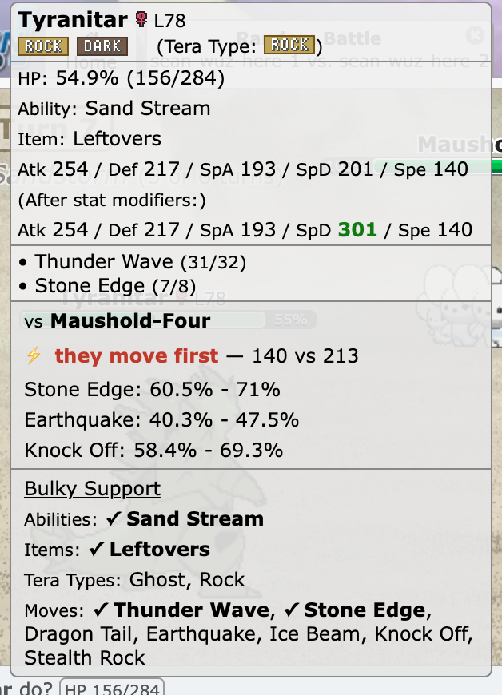
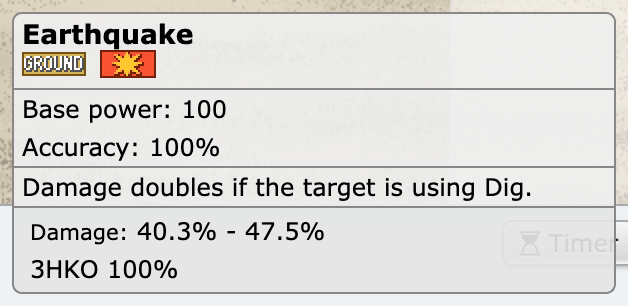

*(hi-chew × pikachu)*

<p align="center">
  
  
</p>

Battle hints, one hover away. hi-chu is a small browser extension that enriches
[Pokémon Showdown][showdown]'s in-battle tooltips:

- How much damage will each move do?
- What Random Battles set is the opponent Pokémon running?
- Who's faster?

Grabs set data from [`pkmn.github.io/randbats`][feed] and calculates damage with
[`@smogon/calc`][calc].

## How it's built

The design is a small pure core behind a thin shell, and the shell itself splits in two:
`content.ts` is the only *impure* piece — it monkey-patches Showdown's tooltip and touches
the DOM/network directly — but it hands the actual work to `section.ts`, which is pure
(no DOM, no cache, no network of its own) and does the real folding. Below that, three
steps stay strictly separate — **read** (the live page, the network), **reason** (the
domain logic), **render** (model → HTML) — so a step never reaches into the DOM or the
network unless that IS its job.

### Producing a damage number

```
┌───────────────────────────────────────────────────────────────┐
│ content.ts                           the shell (impure) · DOM │
│ monkey-patches Showdown's tooltip,                            │
│ triggers the fetch, hands the hover to section.ts             │
└───────────────────────────────────────────────────────────────┘
                                │ hover event
                                ▼
┌───────────────────────────────────────────────────────────────┐
│ section.ts                                  pure orchestrator │
│ given the battle, the hover, and the data                     │
│ → folds READ → REASON → RENDER into one HTML string           │
└───────────────────────────────────────────────────────────────┘
──────────── the pipeline — READ → REASON → RENDER ──────────────
                                │
                                ▼
┌───────────────────────────────────────────────────────────────┐
│ READ                            the live page + the sets feed │
│ ┌───────────────────────────┐   ┌───────────────────────────┐ │
│ │ battle/readState.ts       │   │ data/randbats.ts          │ │
│ │ client Pokemon objects    │   │ fetch + cache             │ │
│ │ → LiveFacts: only what    │   │ the sets feed             │ │
│ │ the battle has made public│   │                           │ │
│ └───────────────────────────┘   └───────────────────────────┘ │
└───────────────────────────────────────────────────────────────┘
                                │ what we KNOW
                                ▼
┌───────────────────────────────────────────────────────────────┐
│ REASON                                pure: given x, return y │
│ ──────── what the foe COULD be — exactly one source ───────── │
│ ┌───────────────────────────┐   ┌───────────────────────────┐ │
│ │ resolve.ts           feed │   │ assume.ts         no feed │ │
│ │ every set the species     │   │ the two spreads that      │ │
│ │ can run, narrowed by      │   │ BRACKET it: uninvested /  │ │
│ │ public reveals            │   │ max HP+Def                │ │
│ └───────────────────────────┘   └───────────────────────────┘ │
│               └───────────────┬───────────────┘               │
│                               │ what we ASSUME                │
│                               ▼                               │
│ ┌───────────────────────────────────────────────────────────┐ │
│ │ buildResolved                                 ResolvedMon │ │
│ │ known facts win; the source fills the gaps                │ │
│ │ → the concrete set(s) we calculate with                   │ │
│ └───────────────────────────────────────────────────────────┘ │
│                               │                               │
│                               ▼                               │
│ ┌───────────────────────────────────────────────────────────┐ │
│ │ damage.ts (calc)                             DamageReport │ │
│ │ wrap @smogon/calc; own the multi-hit law                  │ │
│ │ → one DamageReport per possible set                       │ │
│ └───────────────────────────────────────────────────────────┘ │
│                               │                               │
│                               ▼                               │
│ ┌───────────────────────────────────────────────────────────┐ │
│ │ variants.ts                                  DamageBucket │ │
│ │ collapse identical numbers, name what differs             │ │
│ │ → one line per DISTINCT outcome                           │ │
│ └───────────────────────────────────────────────────────────┘ │
└───────────────────────────────────────────────────────────────┘
                                │
                                ▼
┌───────────────────────────────────────────────────────────────┐
│ RENDER                                pure: given x, return y │
│ ┌───────────────────────────────────────────────────────────┐ │
│ │ render.ts                                            HTML │ │
│ │ model → tooltip HTML string                               │ │
│ └───────────────────────────────────────────────────────────┘ │
└───────────────────────────────────────────────────────────────┘
                                │ tooltip HTML
                                ▼
──────────── the pipeline — READ → REASON → RENDER ──────────────
┌───────────────────────────────────────────────────────────────┐
│ section.ts                                  pure orchestrator │
│ the folded pipeline result                                    │
│ → handed back to content.ts as one HTML string                │
└───────────────────────────────────────────────────────────────┘
```

### Narrowing what the foe could be

The pipeline above answers *what would this move do*. The half that makes the tooltip worth
reading answers *what could that Pokémon even be*.

```
────────── inside READ → REASON — observe, then judge ───────────
┌───────────────────────────────────────────────────────────────┐
│ battle/readState.ts                               public only │
│ the protocol log — evidence about turns already FOUGHT,       │
│ which is a different output from the LiveFacts snapshot       │
│ of how things stand now                                       │
└───────────────────────────────────────────────────────────────┘
         ┌──────────────────────┼──────────────────────┐
         │                      │                      │
         ▼                      ▼                      ▼
┌─────────────────┐    ┌─────────────────┐    ┌─────────────────┐
│ deductions.ts   │    │ itemreveal.ts   │    │ speedreveal.ts  │
│ did a side      │    │ what NUMBER did │    │ who moved       │
│ effect fire?    │    │ a hit deal?     │    │ first?          │
│                 │    │ (asks the calc) │    │                 │
│                 │    │                 │    │                 │
│ Life Orb recoil,│    │ theirs into us: │    │ Choice Scarf —  │
│ hazard damage,  │    │ Choice Specs;   │    │ the one axis a  │
│ an orb that     │    │ ours into them: │    │ damage number   │
│ stayed silent   │    │ Assault Vest    │    │ can never show  │
└─────────────────┘    └─────────────────┘    └─────────────────┘
         └──────────────────────┴──────────────────────┘
                                │ per still-possible set
                                ▼
┌───────────────────────────────────────────────────────────────┐
│ the sets still standing                         never emptied │
│ a deduction lands via narrow.ts BEFORE a set is built, so     │
│ a role whose item pool empties is dropped whole. The other    │
│ two judge sets already built. None of them may narrow the     │
│ candidates to nothing — a rule-out is an inference from       │
│ something that did NOT happen, so one that kills every set    │
│ is likelier wrong than the species impossible                 │
└───────────────────────────────────────────────────────────────┘
                                │
                                ▼
┌───────────────────────────────────────────────────────────────┐
│ back into REASON                 one narrowing, every surface │
│ the same pool the pipeline above calculates with, so the      │
│ speed verdict, the damage and the Items line cannot           │
│ disagree about one set                                        │
└───────────────────────────────────────────────────────────────┘
─────── narrowing needs a set feed — Random Battles only ────────
```

For exact shapes and signatures, read the source and the `*.test.ts` next to each module —
the tests double as worked examples, pinned against real Showdown numbers.

## Develop

```sh
npm install
npm run check         # THE GATE — typecheck + lint + tests + dependency cruise + module graph. What CI runs.
npm test              # the math, the merge, the render, field effects, the dependency boundary, and an end-to-end run on real data
npm run typecheck
npm run lint          # oxlint
npm run build         # bundles to dist/ (content.js + manifest.json) — Chrome
npm run build:safari  # bundles to dist-safari/ — Safari (see Install below)
npm run watch         # rebuild on save
```
`npm run check` is the one that means "done" — the rest are the fast inner loop. Passing
`npm test` alone leaves the linter, the dependency cruise and the generated module graph
unrun, and CI checks all three.

`npm install` also points git at `.githooks/` (the `prepare` script), which refuses a commit
or push made directly against `main` — every change goes through a branch + PR instead,
matching `main`'s GitHub branch protection.

## Install

**From a release (no build needed):**

1. Download `hi-chu-<version>.zip` from the [latest release][releases] and unzip it.
2. Visit `chrome://extensions`, enable **Developer mode** (top-right).
3. **Load unpacked** → select the unzipped folder.
4. Open a battle on `play.pokemonshowdown.com` and hover a Pokémon or one of your
   move buttons — the extra lines appear at the bottom of the tooltip. (A Random Battle
   gets everything; any other format gets the damage lines.)

*(Firefox: `about:debugging` → **This Firefox** → **Load Temporary Add-on** → pick the
`manifest.json` inside the unzipped folder.)*

**From source:** `npm install && npm run build`, then Load unpacked → `dist/`. Run
`npm run package` to produce the release zip yourself.

**Safari (macOS):** no packaged release yet — build from source. `npm install && npm run
build:safari`, then open `safari/hi-chu/hi-chu.xcodeproj` in Xcode:

1. Signing & Capabilities tab (both the App and Extension targets): enable automatic
   signing and pick a team — any free Apple ID **Personal Team** works, added via Xcode
   → Settings → Accounts.
2. Scheme selector: **hi-chu (macOS)** + **My Mac**, then press Run (▶) — the app must
   actually launch at least once; Safari won't list an extension that's only been built.
3. Safari → Settings → Extensions: enable **hi-chu**.
4. Open a battle on `play.pokemonshowdown.com` and hover a Pokémon.

Safari can't run the same static `content_scripts` declaration Chrome does (see
`CLAUDE.md`'s Architecture section for why), so `dist-safari/` is its own build with a
background service worker filling the gap — `content.ts` itself is unchanged.

## Reporting a bug

[Issues][issues] are welcome — a wrong damage number, a missing deduction, a tooltip
that doesn't match what Showdown itself shows. A [replay link][replays] to the battle is
a big help if you have one: most of what this extension reads (a revealed item, a status
move, a speed tie) only shows up at one specific point in one specific battle, so a replay
lets a fix be checked against the real log instead of guessed at. Not required, though —
describe what you saw and expected, and a reproduction can usually be built from that.

## Verifying a release

Every tagged release ships with a Sigstore-signed [build-provenance attestation][slsa]
and a `SHA256SUMS` file:

```sh
gh attestation verify hi-chu-0.2.0.zip --repo seanaujong/hi-chu
```

A ✓ means GitHub verified the signature: this exact zip was produced by the Release
workflow, from a commit you can inspect. No keys to trust by hand.

**Prove the shipped code matches the source.** The bundled `content.js` is produced
deterministically by esbuild at the version pinned in `package-lock.json`, so you can
rebuild it and compare hashes:

```sh
git checkout v0.2.0
npm ci && npm run build
sha256sum dist/content.js          # compare to content.js in the release's SHA256SUMS
```

Identical hashes mean the code Chrome runs is exactly the open source in this repo.
(The Chrome Web Store repackages and re-signs uploads, so the *installed* extension is
additionally signed by Google — but these two checks are what tie it back to here.)

> **On the install warning.** hi-chu is new, so Chrome's *Enhanced Safe Browsing* may
> note it isn't "trusted" yet — a reputation signal Google grants new extensions over
> time, not a finding about the code. The checks above are the concrete answer to "is
> this safe?": verify the provenance and the source hash yourself.

## Disclaimer

hi-chu is an unofficial, fan-made tool. It is not affiliated with, endorsed by, or associated
with Nintendo, Game Freak, The Pokémon Company, or Pokémon Showdown. "Pokémon" and all related
names are trademarks of their respective owners.

[showdown]: https://pokemonshowdown.com/
[feed]: https://github.com/pkmn/randbats
[calc]: https://github.com/smogon/damage-calc
[releases]: https://github.com/seanaujong/hi-chu/releases/latest
[slsa]: https://docs.github.com/actions/security-guides/using-artifact-attestations-to-establish-provenance-for-builds
[issues]: https://github.com/seanaujong/hi-chu/issues
[replays]: https://replay.pokemonshowdown.com/
