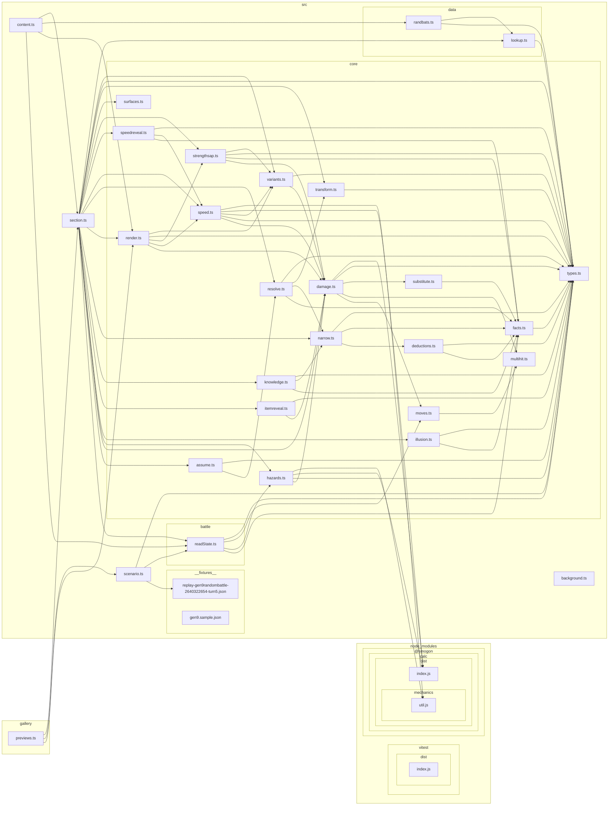

# Module graph

<!-- GENERATED by `npm run graph` — do not edit. -->

Which module imports which, derived from the source. 34 modules, 85 edges.

This is the *current shape*. For what the layers MEAN — why `facts.ts` is a leaf, why every
deduction routes through `narrow.ts` — read the Architecture section of `CLAUDE.md`; for the
pipeline the data flows along, the diagram in `README.md`. Those are arguments and they don't
rot. This one does, which is why it is regenerated rather than maintained.

The rules that FAIL a build are elsewhere and are not restated here: the project's own layering
invariants live in `fitness/dependency-boundaries.test.ts` (run by `npm run check`), and the
structural ones — no cycles, no orphans — in `.dependency-cruiser.cjs` (run by `npm run deps`).

