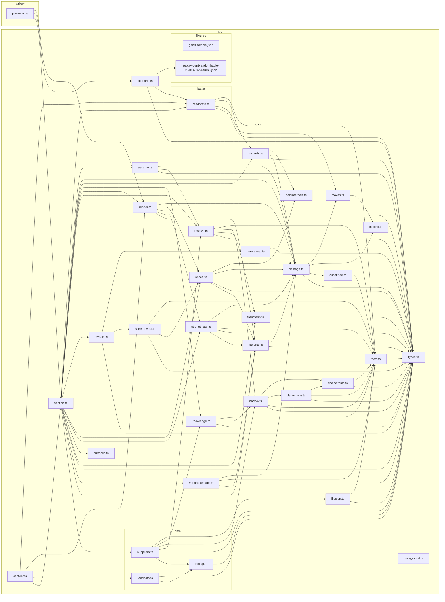

# Module graph

<!-- GENERATED by `npm run graph` — do not edit. -->

Which module imports which, derived from the source. 36 modules, 98 edges.

This is the *current shape*. For what the layers MEAN — why `facts.ts` is a leaf, why every
deduction routes through `narrow.ts` — read the Architecture section of `CLAUDE.md`; for the
pipeline the data flows along, the diagram in `README.md`. Those are arguments and they don't
rot. This one does, which is why it is regenerated rather than maintained.

The rules that FAIL a build are elsewhere and are not restated here: the project's own layering
invariants live in `fitness/dependency-boundaries.test.ts` (run by `npm run check`), and the
structural ones — no cycles, no orphans — in `.dependency-cruiser.cjs` (run by `npm run deps`).

## What we import from outside

Third-party packages are named rather than drawn — a specifier is a fact about this source,
where the path npm resolved it to is a fact about one machine's disk. Reaching past a
package's published surface (a `dist/` path) is a deliberate act and is argued for where it
happens.

| Module | Imports |
|---|---|
| `src/core/calcinternals.ts` | `@smogon/calc`, `@smogon/calc/dist/mechanics/util` |
| `src/core/damage.ts` | `@smogon/calc` |
| `src/core/hazards.ts` | `@smogon/calc` |
| `src/core/speed.ts` | `@smogon/calc` |
